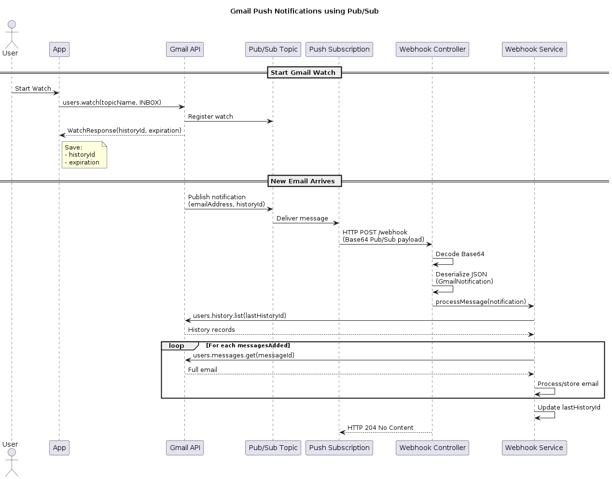

# emstore

### Description
> Application to store received emails in a database

### Technologies
- [Google Cloud Pub/Sub](https://docs.cloud.google.com/pubsub/docs/overview)
- [SQLite](https://sqlite.org/index.html)

### Setup
1. Create a Google Cloud Project
2. Enable APIs: [ `Gmail API`, `Cloud Pub/Sub API` ]
3. In APIs & Services → OAuth consent screen: Configure the app & add yourself as test user
4. Create OAuth Credentials: Create OAuth Client ID with Application Type as "Desktop"
5. Download `credentials.json` & place it in your `src/resources` folder
6. Create a Pub/Sub Topic. For example: `gmail-notifications`
7. Grant Gmail permission to publish: Grant the Gmail service account `gmail-api-push@system.gserviceaccount.com` the role `Pub/Sub Publisher` on your topic.
8. Setup port forwarding using a public service like `ngrok`. Example: `ngrok http --url [custom-endpoint] [application-port]`
9. Create a Push Subscription: Configure Topic `gmail-notifications`, Delivery Type `Push` & Endpoint: `[custom-endpoint]`
10. Authenticate with Gmail: Start the app locally, it will automatically attempt to authenticate you, open your browser & approve the auth request
11. Trigger `/watch` request 

### How it works

1. Trigger `/watch` → Notifies Pub/Sub service to push events
2. Event → `/webhook` → Get email message → Save email data in database

### Endpoints
`/watch` - Trigger watch request to Google Cloud Pub/Sub Service  
`/webhook` - Receive push events from Google Cloud Pub/Sub Service

### Databases
- `gmail_state` - Keep track of received histories to avoid reprocessing events
- `emails` - Store email information
