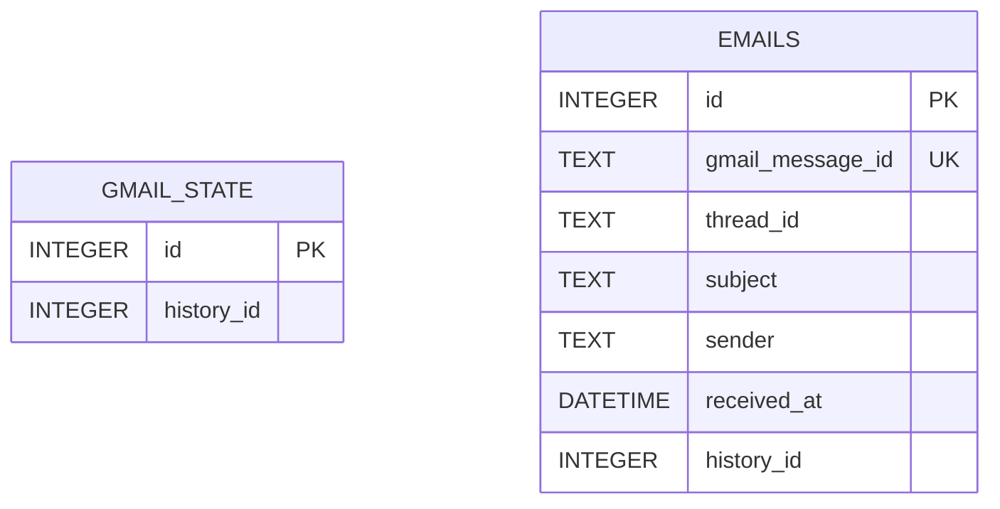

# emstore

### Description
> **emstore** is an event-driven email synchronization application that monitors a Gmail inbox and stores received email metadata in a local SQLite database. It uses the Gmail API and Google Cloud Pub/Sub to receive notifications when new emails arrive, retrieves the corresponding email details, and persists the subject line and other metadata for later reference.

### Technologies
- [ngrok](https://ngrok.com/)
- [SQLite](https://sqlite.org/index.html)
- [Google Cloud Pub/Sub](https://docs.cloud.google.com/pubsub/docs/overview)

### Endpoints
`/watch` - Trigger watch request to Google Cloud Pub/Sub Service  
`/webhook` - Receive push events from Google Cloud Pub/Sub Service

### How it works
The application uses Gmail API watch notifications and Google Cloud Pub/Sub to detect new emails without continuously polling the inbox.

1. Trigger `/watch` → Registers the Gmail inbox for change notifications through Google Cloud Pub/Sub.
2. New email arrives → Gmail publishes a notification to the configured Pub/Sub topic.
3. Pub/Sub → `/webhook` → Sends the notification to the application's webhook endpoint.
4. Application → Gmail API → Uses the notification's `history_id` to identify newly received emails.
5. Email metadata → SQLite → Stores the email subject and associated metadata in the `emails` table.
6. `gmail_state` → Tracks the latest processed `history_id` to prevent duplicate processing.

The result is a local SQLite database containing a synchronized record of received email subjects and their associated metadata.

### Database Schema

### Setup
1. Create a Google Cloud Project
2. Enable APIs: [ `Gmail API`, `Cloud Pub/Sub API` ]
3. In APIs & Services → OAuth consent screen: Configure the app & add yourself as test user
4. Create OAuth Credentials: Create OAuth Client ID with Application Type as "Desktop"
5. Download `credentials.json` & place it in your `src/resources` folder
6. Create a Pub/Sub Topic. For example: `gmail-notifications`
7. Grant Gmail permission to publish: Grant the Gmail service account `gmail-api-push@system.gserviceaccount.com` the role `Pub/Sub Publisher` on your topic.
8. Setup port forwarding using a public service like `ngrok`. Example: `ngrok http --url [custom-endpoint] [application-port]`
9. Create a Push Subscription: Configure Topic `gmail-notifications`, Delivery Type `Push` & Endpoint: `[custom-endpoint]`
10. Authenticate with Gmail: Start the app locally, it will automatically attempt to authenticate you, open your browser & approve the auth request
11. Trigger `/watch` request 
